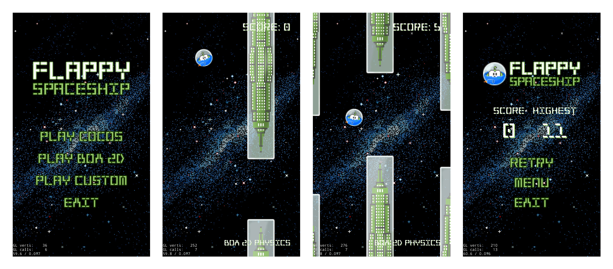

# Flappy Spaceship

**Flappy Spaceship** is a Flappy Bird clone with three identical game modes that use different physics engines.

Made with Cocos2d-x.

## Where to play

You can download the .apk file of the game for Android from Google Drive: [link](https://drive.google.com/file/d/1fxlA0VIcdm7SatEqWynF-RFH1rx8vzLa/view?usp=sharing).

## How to play

Tap the screen! 
Avoid the buildings!

**The goal:** reach as far as you can, your score will be saved.

## Screenshots

## Influencers

* [Flappy Bird](https://en.wikipedia.org/wiki/Flappy_Bird)

## Disclamer

The game was written as a test project in 2018. It isn't currently updated or maintained.

## License

Copyright 2018 (C) Jan Fazli.

Licensed under the MIT License.
